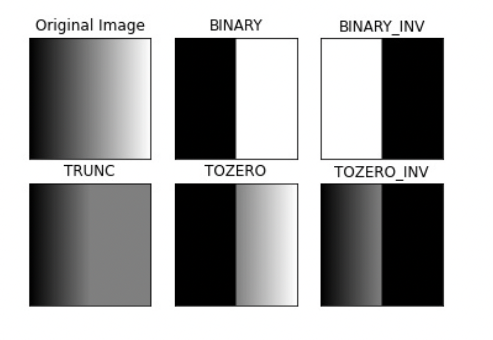
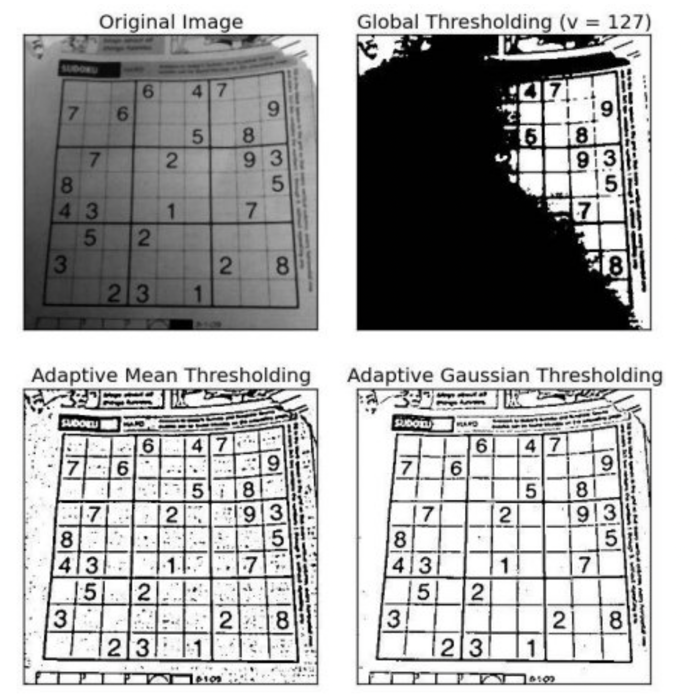

# HMM Textract Documentation

## Concepts

### Ground Truth Label
These are the true or correct annotations or labels associated with the data, in this case it is the text present in the image.

This is typically done by human annotators who carefully examine the images and mark the boundaries of text regions associating them with the corresponding text.

### Preprocessing Techniques

#### Resizing

Its modifying the image size through its dimensions (width & height) of an image while maintaining its aspect ratio or altering it as needed.

When downscaling an image sometimes its needed anti-aliasing techniques such as jagged edges or pixelation.

Interpolation its used to estimate the pixel values in the resized image based on the values of neighboring pixels in the original image. There are also many interpolation techniques.

#### Interpolation Techniques

##### Nearest-Neighbor

##### Bilinear

##### Cubic interpolation

#### Noise Removal

This is a technique done to reduce unwanted random variations or disturbances in an image which is what we refer to as "noise". This can be introduced because due to factors such as poor lighting conditions, sensor limitations, compression artifacts, or transimission errors.

There are different types of noise such as Gaussian noise, which follows a Gaussian distribution and appears as random variations in brightness. Salt-and-pepper noise manifests as random white and black pixels scattered throughout the image.

There are reduction filters or techniques to reduce noise from an image:
- Gaussian Blur: This filters applies a weighted average to each pixel neighborhood effectively blurring the image and smoothing out small-scaled variations.
- Median Filter: Replaces each pixel value with the median value of its neighboring pixels, useful for salt-and-pepper noise without blurring the edges.
- Bilateral Filter: Combination of spatial and intensity weights to preserve edges while reducing noise.

#### Contrast Adjustment

Enchances the quality and distinguishability of an image by expanding or compressing its range of pixel intensities. It aims to improve the perception of details.

1. Histogram: First step is to analyze the histogram, with this, we can get an understanding of the overall contrast present in the image.

2. Intensity Scaling: Linear mapping the pixel intensities of the image to a new range.
- We find the minimum and maximum values.
- Then define the desired minimum and maximum intensities (0 and 255 for example).
- Finally we use a linear mapping function to rescale it.
```
new_intensity = (old_intensity - min_intensity) * ((new_max - new_min) / (max_intensity - min_intensity)) + new_min
```
3. Histogram Equalization: It redistributes the pixel intensities in the image to make the histogram as uniformly distributed as possible.

#### Binarization

Converts a grayscale image or color image into a binary image where each pixel is represented by only two values: black or white. This is commonly applied in text extraction tasks to separate the foreground from the background.

1. Thresholding: This involves selecting a treshold value to divide the pixel intensities into two groups, those below and above or equal to the treshold.

2. Global Tresholding: Uses a single treshold value that is applied to all pixels in the image.
- Otsu's Tresholding: Otsu's method automatically calculates the optimal trehsold value, maximizing the between-class variance of the pixel intensities.

3. Adaptive tresholding: this methods take into account local variations in image intensity and adjust the treshold value in order to it. This is useful when the ilumination conditions or contrast levels vary across different regions of the image.

##### Otsu's Binarization
In global thresholding, we use an arbitrary chosen value as a threshold. In contrast, Otsu's method avoids having to choose a value and instead, determines it automatically.

### Feature Extractions

#### HOG

Histogram of Oriented Gradients is a popular technique in detection and recognition where it captures the shape and gradient in an image by analyzing the distribution of gradient orientations.

First we calculate the gradient of the image, usually a Sobel operator is applied to obtain the horizontal and vertical derivatives of the image.
The image is divided into smaller images (for example 8 x 8 pixels) for each of this cells, the gradients and orientations are computed. Then the orientations are quantizied into a number of bins (9 bins covering from 0 to 180 degrees for example).

The histogram values then get normalized to robust changes in illumination, contrast, etc. This is usually done with a large block splitted in cells. The idea is to normalize the histogram of each cell in order to the neighboring cells in the block. Finally, the histograms are concatenated in a vector with the distributions of gradient orientations.

#### SIFT


#### CNN's


## Libraries

### CV2

#### imread

```py
cv2.imread(filename, flag)
```
Where:  
```filename```: path to the image file.  
```flag```: way how image is read.    
- cv2.IMREAD_COLOR - It specifies to load a **color image**. Any transparency of image will be neglected. It is the default flag. Alternatively, we can pass integer value 1 for this flag.

- cv2.IMREAD_GRAYSCALE – It specifies to load an image in **grayscale mode**. Alternatively, we can pass integer value 0 for this flag. 

- cv2.IMREAD_UNCHANGED – It specifies to load an image as such including **alpha channel**. Alternatively, we can pass integer value -1 for this flag.

Returns a **NumPy array** if the image is loaded successfully.

```py
cv2.adaptiveThreshold(image, classifier, value, threshold)
```
1. Image: Grayscale Image.

2. Classifier: Threshold value to classify the pixel values.

3. Value: Value assigned to pixels exceeding the threshold.

4. Thresholds provided by OpenCV.

- cv.THRESH_BINARY
- cv.THRESH_BINARY_INV
- cv.THRESH_TRUNC
- cv.THRESH_TOZERO
- cv.THRESH_TOZERO_INV



```py
cv2.threshold(threshold, block_size)
```

The previous function uses a global value as a threshold but it might not work in all cases. If an image has different lightning conditions, adaptive threshold can help. Here, the algorithm determines the threshold for a pixel based on a small region around it. 

1. Threshold: How the threshold is calculated
- ADAPTIVE_THRESH_MEAN_C: Mean of the neighbor area minus the constant C.
- ADAPTVIE_THRESH_GAUSSIAN_C: Gaussian-weighted sum of the neighborhood values minus the constant C.

2. Block Size: determines the neighbourhood area and C is a constant that is substracted from the mean or weighted sum of the neighbourhood pixels.


